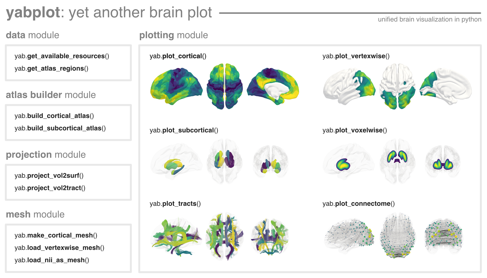

# yabplot: yet another brain plot


[](https://pypi.org/project/yabplot/)
[](https://teanijarv.github.io/yabplot/)
[](https://github.com/teanijarv/yabplot/actions/workflows/tests.yml)
[](https://doi.org/10.5281/zenodo.18237144)

**yabplot** is a Python library for creating publication-quality 3D brain visualizations. it provides a unified interface for cortical regions, subcortical structures, white matter bundles, connectomes, voxel-wise maps, and vertex-wise maps.

the idea is simple. while there are already amazing visualization tools available, they often focus on specific domains—using one tool for white matter tracts and another for cortical surfaces inevitably leads to inconsistent styles. i wanted a unified, simple-to-use tool that enables me (and hopefully others) to perform most brain visualizations in a single place. recognizing that neuroscience evolves daily, i designed **yabplot** to be modular: it supports standard pre-packaged atlases out of the box, but easily accepts any custom parcellation or tractography dataset you might need. moreover, it enables to plot volumetric data either voxel-wise or by projecting the data to cortical surface or white matter tracts.

## features

* **unified plotting API:** plot cortical regions, vertex-wise maps, subcortical structures, voxel-wise maps, white-matter tracts, and connectomes with a consistent interface.
* **pre-packaged resources:** access commonly used atlases and meshes on demand, including schaefer, brainnetome, aparc, aseg, musus100, and xtract atlases.
* **flexible data mapping:** pass data as arrays for strict ordering or dictionaries for partial/name-based mapping.
* **custom atlases:** build and use custom cortical parcellations, subcortical segmentations, and tractography datasets.
* **volume projection:** project nifti images to cortical surfaces or tractograms for vertex-wise and tractometry visualizations, or plot the volumes voxel-wise.
* **publication-oriented output:** generate static figures, saved images, and interactive 3D views.

## installation

```bash
uv add yabplot # to install
uv sync --upgrade-package yabplot # to update
```
or
```bash
pip install yabplot # to install
pip install yabplot --upgrade # to update
```

dependencies: python 3.11 with ipywidgets, nibabel, matplotlib, pandas, pooch, pyvista, scikit-image, trame, trame-vtk, trame-vuetify

(Connectome Workbench (`wb_command`) is a requirement to create custom cortical atlases unless you plan to only use pre-loaded atlases; see more in docs)

## quick start

please refer to the [documentation](https://teanijarv.github.io/yabplot/) for more comprehensive guides.

```python
import yabplot as yab
import numpy as np

# check that you have the latest version
print(yab.__version__)

# see available atlases and brain meshes
print(yab.get_available_resources())

# see the region names for a specific atlas
print(yab.get_atlas_regions(atlas='aseg', category='subcortical'))

# plotting cortical surface regions
atlas = 'aparc'
dmap1 = {'L_lateraloccipital': 0.265, 'L_postcentral': 0.086}
ax = yab.plot_cortical(data=dmap1, atlas=atlas, vminmax=[0.0, 0.3], cmap='viridis',
    bmesh='midthickness', views=['left_lateral', 'left_medial'])

# plotting subcortical regions
atlas = 'aseg'
regs = yab.get_atlas_regions(atlas=atlas, category='subcortical')
data = np.arange(1, len(regs)+1)
ax = yab.plot_subcortical(data=data, atlas=atlas, vminmax=[2, 14], 
    views=['left_lateral', 'superior', 'right_lateral'], 
    bmesh_alpha=0.1, cmap='plasma')

# plotting white matter tracts
atlas = 'xtract_medium'
regs = yab.get_atlas_regions(atlas=atlas, category='tracts')
data = {reg: np.sin(i) for i, reg in enumerate(regs)}
ax = yab.plot_tracts(data=data, atlas=atlas, style='matte', cmap='coolwarm',
    views=['left_lateral', 'anterior', 'superior'], bmesh='pial')

# plotting connectome
data = np.random.rand(400, 400)
ax = yab.plot_connectome(matrix=data, atlas='schaefer400',
    edge_cmap='dense', node_cmap='binary', edge_threshold='95%', 
    views=['left_lateral', 'superior', 'posterior']
)

# volume projection to cortical surface and vertexwise plotting
threshold = 4
b_lh_path, b_rh_path = yab.data.get_surface_paths('midthickness', 'bmesh')
lh_data, rh_data = yab.project_vol2surf('path/to/yourdata.nii.gz', bmesh='midthickness')
lh_data = np.where(lh_data > threshold, lh_data, np.nan)
rh_data = np.where(rh_data > threshold, rh_data, np.nan)
lh_mesh, rh_mesh = yab.load_vertexwise_mesh(b_lh_path, b_rh_path, lh_data, rh_data)
ax = yab.plot_vertexwise(lh_mesh, rh_mesh, cmap='viridis', vminmax=[-10, 10], 
                    views=['left_lateral', 'left_medial'])

# plotting volume voxel-wise 
threshold = '99.5%'
nii_path = 'path/to/yourdata.nii.gz'
ax = yab.plot_voxelwise(nii_path, threshold='99%', cmap='Reds',
    views=['left_lateral', 'superior', 'anterior'])

```



## acknowledgements

yabplot relies on the extensive work of the neuroimaging community. if you use these atlases in your work, please cite the original authors. if you use this package for any scientific work, please cite the DOI (see more info on [Zenodo](https://doi.org/10.5281/zenodo.18237144)).
